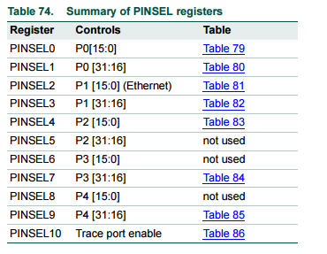
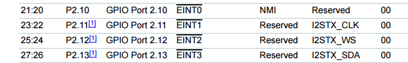
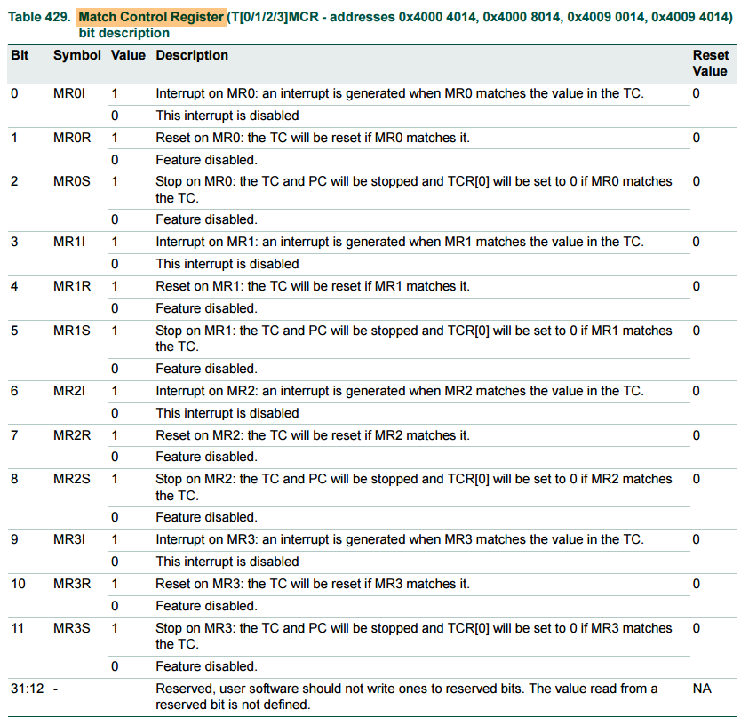
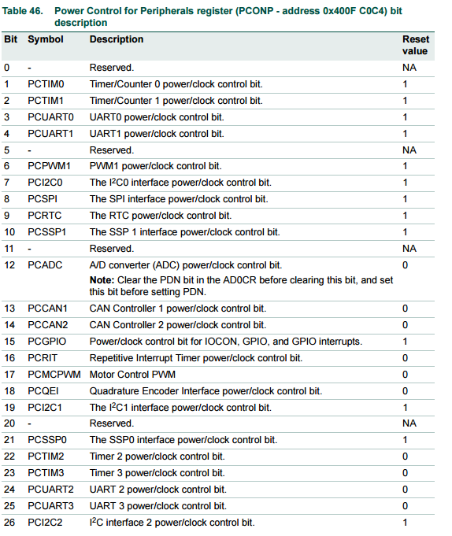
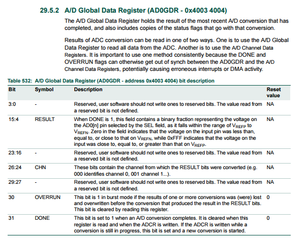

<h1> Landtiger LPC1768 ARM Cortex M3 - CheatSheet</h1>
</h2>Revalor Riccardo - [Github Repo for this CheatSheet](https://github.com/RiccardoRevalor/LandTiger1768_CheatSheet)</h2>

## Summary

- 🔋 [Power Down Mode](#power-down-mode)

- 🚨 [LEDs](#leds)
  - [LED Header](#led-header)
  - [LED Init](#led-init)
  - [LED_On, LED_Off, LED_Out](#led_on-led_off-led_out)


- 🖲️ [Buttons (bouncing!)](#buttons-bouncing)
  - [Buttons Header](#buttons-header)
  - [Buttons Init](#buttons-init)
  - [Buttons IRQ Handlers](#buttons-irq-handlers)

- ⏱️ [Generic Timers](#generic-timers)
  - [Calculating Timer Counter](#calculating-the-timer-counter)
  - [Timer header](#timer-header-file)
  - [Timer initialization](#timers-initialization-enable-disable-reset)
  - [Timer IRQHandler](#timer-irqhandler)
  - [Retrieve Counter Value](#retrieve-timer-counter-value)

- 🕒 [RIT Timer](#rit-timer)
  - [RIT header](#rit-header-file)
  - [RIT initialization](#rit-initialization-enable-disable-reset)
  - [RIT IRQHandler](#rit_irqhandler)

- 🕒 [SYSTICK Timer (Assembly only)](#systick-timer-assembly-only)
  - [SYSTICK Registers Contants](#systick-registers-constants)
  - [SYSTICK Initialization](#systick-initialization)
  - [SYSTICK Predefined Handler](#systick-handler)
  - [Retrieve SYSTICK Counter Value](#retrieve-systick-counter-value)

- 🎮 [Joystick](#joystick)
  - [Initialization](#joystick-initialization---joystick_init)
  - [Polling with RIT](#joystick-rit-polling---rit_irqhandler)

- 🎚️ [ADC with Potentiometer](#adc-to-be-used-with-potentiometer)
  - [ADC Header](#adc-header-file)
  - [ADC Initialization/Start conversion](#adc-initialization-and-start_conversion---adc_init-adc_start_conversion)
  - [ADC IRQHandler](#adc-handler---adc_irqhandler)
  - [Multiple conversions with RIT](#use-of-rit-for-multiple-conversions-at-a-certain-rate)

- 🔊 [DAC Connected to the Speaker](#dac-connected-to-the-speaker)
  - [DAC Value Conversion](#convert-a-value)

- 💻 [SVC - Supervisor Calls (Assembly only)](#svc---supervisor-calls-assembly-only)
  - [SVC call in Reset Handler](#svc-call-in-reset-handler)
  - [SVC Handler](#svc-handler)

- 💻 [Bubble Sort](#bubble-sort)
  - [Bubble Sort in C](#bubble-sort-in-c)
  - [Bubble Sort in Assembly - **32 BIT R/W MEMORY AREA**](#bubble-sort-in-assembly---32-bit-rw-memory-area---adx-multiple-of-4-and-ldrstr)

- 💻 [LCD and Touch Screen](#lcd-and-touch-screen)
  - [LCD Initialization and Configuration](#lcd-initialization-and-configuration)
  - [LCD Clear](#lcd-clear)

- [Resources](#resources)  


## Power Down Mode
Put at the end of `sample.c`:
```c
LPC_SC->PCON |= 0x1; /* power-down	mode */
LPC_SC->PCON &= ~(0x2);						
		
while (1) { /* Loop forever */	
	__ASM("wfi");
}
```

## LEDs

### LED Header
#### File: `led.h`
```c
/* lib_led */
void LED_init(void);
void LED_deinit(void);

/* funct_led */
void LED_On (unsigned int num);
void LED_Off (unsigned int num);
void LED_Out(unsigned int value);
```

### LED Init
#### File: `lib_led.c`
```c
#include "lpc17xx.h"
#include "led.h"

unsigned char led_value;

void LED_init(void) {
	LPC_PINCON->PINSEL4 &= 0xFFFF0000;	//PIN mode GPIO (00b value per P2.0 to P2.7)
	//SEE PAGE 123 OF MANUAL TO SET FIODIR
	LPC_GPIO2->FIODIR   |= 0x000000FF;  //P2.0...P2.7 Output (LEDs on PORT2 defined as Output)
	/* LPC_GPIO2->FIOSET    = 0x000000FF;	//all LEDs on */
	LPC_GPIO2->FIOCLR    = 0x000000FF;  //all LEDs off
	led_value = 0;
}

void LED_deinit(void) {

  LPC_GPIO2->FIODIR &= 0xFFFFFF00;  
}
```

### LED_On, LED_Off, LED_Out
#### File: `funct_led.c`

**REMEMBER: LEDs on the board go from LD4 (the leftmost LED on the emulator) to LD11 (the rightmost LED on the emulator)** </br>
**To switch on LED x you have to do: LED_On(11-x)** </br>
**LD4 -> LED_On(7)** </br>
**LD11 -> LED_On(0)** </br>
**LED_Out(...) also works this way, showing the result from LD11 (LSB) to LD4 (MSB)** </br>
```c
#include "lpc17xx.h"
#include "led.h"

#define LED_NUM     8                   /* Number of user LEDs                */
const unsigned long led_mask[] = { 1UL<<0, 1UL<<1, 1UL<<2, 1UL<< 3, 1UL<< 4, 1UL<< 5, 1UL<< 6, 1UL<< 7 };
extern unsigned char led_value;

void LED_On(unsigned int num) {
  	LPC_GPIO2->FIOPIN |= led_mask[num];
	led_value = LPC_GPIO2->FIOPIN;
}

void LED_Off(unsigned int num) {
  	LPC_GPIO2->FIOPIN &= ~led_mask[num];
	led_value = LPC_GPIO2->FIOPIN;
}

void LED_Out(unsigned int value) {
  int i;

  for (i = 0; i < LED_NUM; i++) {
    if (value & (1<<i)) {
      LED_On (i);
    } else {
      LED_Off(i);
    }
  }
	led_value = value;
}
```

## Buttons (bouncing!)

### Buttons Header
#### File: `button.h`
```c
#include "LPC17xx.h"

void BUTTON_init(void);
void EINT1_IRQHandler(void);
void EINT2_IRQHandler(void);
void EINT3_IRQHandler(void);
```

### Buttons Init
#### File: `lib_button.c`

```c
#include "button.h"
#include "LPC17xx.h"
void BUTTON_init(void) {

  //INT0 -> PINSEL4 BITS 21:20, FIODIR PIN 2.10
  LPC_PINCON->PINSEL4    |= (1 << 20);		 
  LPC_GPIO2->FIODIR      &= ~(1 << 10);    
  
  //KEY1 -> PINSEL4 BITS 23:22, FIODIR PIN 2.11
  LPC_PINCON->PINSEL4    |= (1 << 22);     
  LPC_GPIO2->FIODIR      &= ~(1 << 11);    
  
  //KEY2 -> PINSEL4 BITS 25:24, FIODIR PIN 2.12
  LPC_PINCON->PINSEL4    |= (1 << 24);     
  LPC_GPIO2->FIODIR      &= ~(1 << 12);    

  LPC_SC->EXTMODE = 0x7;

  NVIC_EnableIRQ(EINT2_IRQn);              /* enable irq in nvic                 */
	NVIC_SetPriority(EINT2_IRQn, 1);				 /* priority, the lower the better     */
  NVIC_EnableIRQ(EINT1_IRQn);              /* enable irq in nvic                 */
	NVIC_SetPriority(EINT1_IRQn, 2);				 
  NVIC_EnableIRQ(EINT0_IRQn);              /* enable irq in nvic                 */
	NVIC_SetPriority(EINT0_IRQn, 3);				 /* decreasing priority	from EINT2->0	 */
}
```

### Buttons IRQ Handlers
#### File: `IRQ_button.c`

```c
#include "button.h"
#include "LPC17xx.h"

#include "../led/led.h" 					

void EINT0_IRQHandler (void)	  	/* INT0														 */
{		
	
	LPC_SC->EXTINT &= (1 << 0);     /* clear pending interrupt         */
}


void EINT1_IRQHandler (void)	  	/* KEY1														 */
{
	
	LPC_SC->EXTINT &= (1 << 1);     /* clear pending interrupt         */
}

void EINT2_IRQHandler (void)	  	/* KEY2														 */
{
	
  LPC_SC->EXTINT &= (1 << 2);     /* clear pending interrupt         */    
}
```

## Generic Timers

Power: In the PCONP register (Table 46), set bits PCTIM0/1/2/3. <br>
**Remark**: On reset, Timer0/1 are enabled (PCTIM0/1 = 1), and Timer2/3 are disabled 
(PCTIM2/3 = 0). <br>
**To activate TIM2/3**: go to the **Configuration Wizard** of file `system_LPC17xx.c` > *Clock configuration* > *Power Control for Peripheral Registers (PCONP)* > check *PCTIM2* or *PCTIM3*.

### Calculating the timer counter 
In `sample.c` you have to call the function to set the timer:
```c
init_timer(timerNumber, K);	
enable_timer(timerNumber);	
```
The timer numer is used to select the timer and goes from 0 to 4. <br>
The general rule for assigning the counter starting value is this: <space>
$K = T * Freq$ <space> (K converted to hex)<br>
$Freq$ is usually 25 Mhz (CCLK / 4) <br>
$T$ is related to what you want to have as the timer interval. <br> 

### Timer header file

#### File: `timer.h`
```c
#ifndef __TIMER_H
#define __TIMER_H

#include "LPC17xx.h"

/* init_timer.c */
extern uint32_t init_timer( uint8_t timer_num, uint32_t timerInterval );
extern void enable_timer( uint8_t timer_num );
extern void disable_timer( uint8_t timer_num );
extern void reset_timer( uint8_t timer_num );
/* IRQ_timer.c */
extern void TIMER0_IRQHandler (void);
extern void TIMER1_IRQHandler (void);

#endif /* end __TIMER_H */
```

### Timers Initialization, enable, disable, reset
Given a specific timer, you can assign different values to its Match Registers.
The Match Control Register is used to set the behavior of te timer once a match has occurred. <br>
For example, regarding MR0 we can set:
| BIT Number| If set to 1         | If set to 0  |
|-----------|---------------------|--------------|
|    0      | interrupt generated  | no interrupt|
|    1      | reset TC after match       | no reset      |
|    2      | stop the timer after match       | no stop       |
And so on for the other MR, by using higher bits (bit 3,4,5 for MR1 etc)

#### File: `lib_timer.c`

```c 
#include "LPC17xx.h"
#include "timer.h"

uint32_t init_timer ( uint8_t timer_num, uint32_t TimerInterval )
{
  if ( timer_num == 0 ) {
	LPC_TIM0->MR0 = TimerInterval;
	//LPC_TIM0->MR1 = OtherValue if needed
	LPC_TIM0->MCR = 3; 
	//3 -> 011 -> yes interrupt, yes reset, no stop
	//7 -> 111 -> yes interrupt, yes reset, yes stop
	NVIC_EnableIRQ(TIMER0_IRQn);
	NVIC_SetPriority(TIMER0_IRQn, 0);	
	return (1);
  } else {
	//other timers...
  }

  return (0);
}

void enable_timer( uint8_t timer_num ) {
  if ( timer_num == 0 )
  {
	LPC_TIM0->TCR = 1;
  }
  else
  {
	//other timers...
  }
  return; //NOW TCR IS 1 SO NOW TIMER0 COUNTER STARTS COUNTING
}

void disable_timer( uint8_t timer_num )
{
  if ( timer_num == 0 )
  {
	LPC_TIM0->TCR = 0;
  }
  else
  {
	//other timers...
  }
  return;
}

void reset_timer( uint8_t timer_num )
{
  uint32_t regVal;

  if ( timer_num == 0 )
  {
	regVal = LPC_TIM0->TCR;
	regVal |= 0x02;
	LPC_TIM0->TCR = regVal;
  }
  else
  {
	//other timers
  }
  return;
}


```
### TIMER IRQHandler
Handler for TIMER0 as example:

#### File: `IRQ_timer.c`
```c 
#include "LPC17xx.h"
#include "timer.h"
#include "../led/led.h"
void TIMER0_IRQHandler (void){
	
	//your code here
	
	LPC_TIM0->IR |= 1;			/* clear interrupt flag */
	return;
}
``` 
Remember: if you declare a variable as `static` inside the Timer handler (or anywhere in the code) its value is updated every time it's modified by subsequent interrupts and you can keep track of it without its lost!

### Retrieve Timer Counter value
For example for Timer0:
```c
//after having imported: #include "LPC17xx.h" 
LPC_TIM0->TC; //32 bit
```

## RIT Timer
### Remember: if you can use RIT instead of the other 4 timers, USE RIT!
In `sample.c` you have to call the function to set the RIT timer:
```c
init_RIT(0x004C4B40);	/* RIT Initialization 50 msec, suitable for human input*/
enable_RIT();	/* RIT enabled */
```

### RIT header file 
#### File: `RIT.h`
```c
#ifndef __RIT_H
#define __RIT_H

/* lib_RIT.c */
extern uint32_t init_RIT( uint32_t RITInterval );
extern void enable_RIT( void );
extern void disable_RIT( void );
extern void reset_RIT( void );
/* IRQ_RIT.c */
extern void RIT_IRQHandler (void);

#endif /* end __RIT_H */
```

### RIT Initialization, enable, disable, reset
#### File: `lib_RIT.c`
```c
#include "LPC17xx.h"
#include "RIT.h"

void enable_RIT( void )
{
  LPC_RIT->RICTRL |= (1<<3);	
  return;
}

void disable_RIT( void )
{
	LPC_RIT->RICTRL &= ~(1<<3);	
  return;
}

void reset_RIT( void )
{
  LPC_RIT->RICOUNTER = 0;          // Set count value to 0
  return;
}

uint32_t init_RIT ( uint32_t RITInterval )
{
  
	
  LPC_SC->PCLKSEL1  &= ~(3<<26);
  LPC_SC->PCLKSEL1  |=  (1<<26);   // RIT Clock = CCLK
	LPC_SC->PCONP     |=  (1<<16);   // Enable power for RIT
	
	LPC_RIT->RICOMPVAL = RITInterval;      // Set match value		
	LPC_RIT->RICTRL    = (1<<1) |    // Enable clear on match	
											 (1<<2) ;		 // Enable timer for debug	
	LPC_RIT->RICOUNTER = 0;          // Set count value to 0
	
	NVIC_EnableIRQ(RIT_IRQn);
	NVIC_SetPriority(RIT_IRQn,4);
  return (0);
}

```

### RIT_IRQHandler()
#### File:  `IRQ_RIT.c` 
You can put whatever you want to perform the actions at every interval of the RIT.

## JOYSTICK 
In `sample.c` you have to call the function to set both joystick and RIT timer:
```c
joystick_init()         /* initialize joystick GPIO pins */
init_RIT(0x004C4B40);	/* RIT Initialization 50 msec, suitable for human input*/
enable_RIT();	/* RIT enabled */
```
### Joystick Initialization -> `joystick_init() `
#### File: `libjoystick.c`
Pin Sequence: DOWN (1.26), LEFT (1.27), RIGHT (1.28), UP (1.29)
```c
void joystick_init(void) {

    // Set joystick DOWN (pin 1.26)
    LPC_PINCON->PINSEL3 &= ~(3<<20); // SET pin 20, 21 to 00 in PINSEL3
    LPC_GPIO1->FIODIR   &= ~(1<<26); // P1.26 Input

    // Set joystick LEFT (pin 1.27)
    LPC_PINCON->PINSEL3 &= ~(3<<22); // SET pin 22, 23 to 00 in PINSEL3
    LPC_GPIO1->FIODIR   &= ~(1<<27);

    // Set joystick RIGHT (pin 1.28)
    LPC_PINCON->PINSEL3 &= ~(3<<24); // SET pin 24, 25 to 00 in PINSEL3
    LPC_GPIO1->FIODIR   &= ~(1<<28);

    // Set joystick UP (pin 1.29)
    LPC_PINCON->PINSEL3 &= ~(3<<26); // SET pin 26, 27 to 00 in PINSEL3
    LPC_GPIO1->FIODIR   &= ~(1<<29); // P1.29 Input (joystick on PORT1 defined as Input)

	// Set joystick SELECT (pin 1.25)
	LPC_PINCON->PINSEL3 &= ~(3<<18);
	LPC_GPIO1->FIODIR   &= ~(1<<25);

}
```

### Joystick RIT Polling -> `RIT_IRQHandler()`
#### File: `IRQ_RIT.c` 
General Code:
```c
#include "LPC17xx.h"
#include "RIT.h"

int down = 0; 	//for button

void RIT_IRQHandler (void)
{					
	static int up_joystick=0;
	static int down_joystick = 0;
	static int left_joystick = 0;
	static int right_joystick = 0;
	static int select_joystick = 0;
	
	if((LPC_GPIO1->FIOPIN & (1<<29)) == 0){	
		/* Joytick UP pressed */
		up_joystick++;
		switch(up_joystick){
			case 1:
				
				break;
			default:
				break;
		}
	}
	else{
			up_joystick=0;
	}
	
	
	if((LPC_GPIO1->FIOPIN & (1<<26)) == 0){	
		/* Joytick DOWN pressed */
		down_joystick++;
		switch(down_joystick){
			case 1:
			
				break;
			default:
				break;
		}
	}
	else{
			down_joystick=0;
	}
	
	if ((LPC_GPIO1->FIOPIN & (1<<28)) == 0){	
		/* Joystick RIGHT pressed */
		right_joystick++;
		switch(right_joystick){
			case 1:
			
				break;
			default:
				break;
		}
	}
	else{
			right_joystick=0;
	}
	
	if ((LPC_GPIO1->FIOPIN & (1<<27)) == 0){	
		/* Joystick LEFT pressed */
		left_joystick++;
		switch(left_joystick){
			case 1:
			
				break;
			default:
				break;
		}
	}
	else{
			left_joystick=0;
	}


	if((LPC_GPIO1->FIOPIN & (1<<25)) == 0){	
		/* Joystick SELECT pressed */
		select_joystick++;
	}
	
	
	/* button management */
	if(down>=1){ 
		if((LPC_GPIO2->FIOPIN & (1<<11)) == 0){	/* KEY1 pressed */
			switch(down){				
				case 2:				
					/* code here */
					break;
				default:
					break;
			}
			down++;
		}
		else {	/* button released */
			down=0;			
			NVIC_EnableIRQ(EINT1_IRQn);							 /* enable Button interrupts			*/
			LPC_PINCON->PINSEL4    |= (1 << 22);     /* External interrupt 0 pin selection */
		}
	}
	
  LPC_RIT->RICTRL |= 0x1;	/* clear interrupt flag */
	
  return;
}
```
Example Code: <br>
The `if case` for Joystick UP contains an example using LEDs and considering continued pressing (when up == 60, so after 3 sec of continued pressing):
```c
void RIT_IRQHandler (void)
{					
	static int up=0;
	static int position=0;
	static int down_joystick = 0;
	
	if((LPC_GPIO1->FIOPIN & (1<<29)) == 0){	
		/* Joytick UP pressed */
		up++;
		switch(up){
			case 1:
				//turn off the led of currrent position and on the led at position 0
				LED_Off(position);
				LED_On(0);
				position = 0;
				break;
			case 60:	//3sec = 3000ms/50ms = 60
				//60: after 3 sec
				/*
			check after 3 seconds: 
			Tpoll = 50 ms (period of polling)
			Tcheck = 3 seconds = 3000 ms
			1 interval takes 50 ms
			2 interval take 100 ms
			4 intervals take 200 ms
			So I have to wait for 3 seconds is simply Tcheck / Tpoll
			So 3000 ms / 50 ms = 60 intervals of 50 ms each!!!
				*/
				LED_Off(position);
				LED_On(7);
				position = 7;
				break;
			default:
				break;
		}
	}
	else{
			up=0;
	}
		
	if((LPC_GPIO1->FIOPIN & (1<<26)) == 0){	
		/* Joytick DOWN pressed */
		down_joystick++;
	}
	else{
		down_joystick=0;
	}
	
	if ((LPC_GPIO1->FIOPIN & (1<<27)) == 0){	
        /* Joytick LEFT pressed */
		down++; //do something...
	}

    if ((LPC_GPIO1->FIOPIN & (1<<28)) == 0){	
        /* Joytick RIGHT pressed */
		down--;
	}
}
```

## SYSTICK Timer (*Assembly only*)

### Peripherals -> Core Peripherals -> SYSTICK Timer
**SYSTICK Reload Value Register** stores the value to reload when timer reaches 0 -> **24 bit max** value length. <br>
**SYSTICK Current Value Register** stores the current value of the timer. Writing any number clears its content.

### SYSTICK Registers Constants
#### File: `startup_LPC17xx.s`
```asm
SYScontrolAndStatusReg EQU 0xE000E010
SYSreloadValueReg EQU 0xE000E014
SYScurrentValueReg EQU 0xE000E018
```

### SYSTICK Initialization
#### File: `startup_LPC17xx.s`
**To stop the timer** -> save 0 in **SYScontrolAndStatusReg**  <br>
**To set the desired interval between interrupts** -> write value in **SYSreloadValueReg**. **At each Clock Cycle the value gets decremented!**<br>
**To Reset the SYSTICK timer counter** -> write **ANY** value in **SYScurrentValueReg** <br>
**To Start the SYSTICK timer set these bits in SYScontrolAndStatusReg:**
| Bit | Access | Function |
|-----|----------|-----------|
| 2 | R/W | 1 = use processor free running clock<br>0 = use external reference clock (*STCLK*) |
| 1 | R/W | 1 = generate interrupt (exception) when timer reaches 0<br>0 = Do not generate interrupt (exception)|
| 0 | R/W | 1 = **start** SYSTICK Timer<br>0 = **stop** SYSTICK Timer |

```asm
LDR r0, =SYScontrolAndStatusReg
MOV r1, #0
STR r1, [r0] ; step 1
LDR r0, =SYSreloadValueReg
LDR r1, =1023 ; 1023: example value
STR r1, [r0] ; step 2
LDR r0, =SYScurrentValueReg
STR r1, [r0] ; step 3
LDR r0, =SYScontrolAndStatusReg
MOV r1, #7
; 7 -> 111 so all bits 2:0 set to 1
; 3 -> 011
; 5 -> 101
; etc
STR r1, [r0] ; step 4
```

### SYSTICK Handler
#### File: `startup_LPC17xx.s`
The SYSTICK Handler is **already predefined** (don't copy-paste this code) in `startup_LPC17xx.s`, write in it and then use `bx lr` to branch back to the caller code:
```asm
SysTick_Handler PROC
                EXPORT  SysTick_Handler           [WEAK]
					
				; SYSTICK HANDLER
				
				; write code here

				; branch back
				bx lr
                ENDP

```

### Retrieve SYSTICK Counter value
Read from **SYScurrentValueReg**, the value is in **24 bits**.


## ADC (to be used with Potentiometer)
8 channel 12-bit ADC <br>
Using the SIMULATOR, To disable potentiometer *non idealities* you have to go the the emulator Settings (rx click on emulator window)> uncheck *Enable/Disable Potentiometer non ideality* <br>
In `sample.c` you have to call the function to set the ADC:
```c
ADC_init();     /* ADC Initialization */
```
### ADC Header file
#### File: `adc.h`
```c
#include <string.h>

/* lib_adc.c */
void ADC_init (void);
void ADC_start_conversion (void);

/* IRQ_adc.c */
void ADC_IRQHandler(void);
```

### ADC Initialization and start_conversion -> `ADC_init()`, `ADC_start_conversion()`
#### File: `lib_adc.c`
AD Converter 0 (AD0) PINS: 
| PIN          | PINSEL       | AD0          |
|--------------|--------------|--------------|
| P0[23] (0.23)       | PINSEL1      | AD0[0]       |
| P0[24]       | PINSEL1       | AD0[1]       |
| P0[25]       | PINSEL1       | AD0[2]       |
| P0[26]       | PINSEL1       | AD0[3]       |
| P1[30]       | PINSEL3       | AD0[4]       |
| P1[31]       | PINSEL3       | AD0[5]       |

ADC_init() for enabling AD0.5 channel:
```c
void ADC_init (void) {
	
	//In this case I USE P1.31 AS AD0.5
	
	//setup pin function to ADC
  LPC_PINCON->PINSEL3 |=  (3UL<<30);      /* P1.31 is AD0.5                     */
	
	//By defaut, ADC is disabled to save energy, so I have to enabled it
	//BIT 12 IN PCONP IS THE ADC 
  LPC_SC->PCONP       |=  (1<<12);      /* Enable power to ADC block          */

  LPC_ADC->ADCR        =  (1<< 5) |     /* select AD0.5 pin -> set bit 5 to 1 to use AD0 channel 5                 */
                          (4<< 8) |     /* set 4. ADC clock is 25MHz/4    -> it is due to reach the maximum limitation for freq for the board           */
                          (1<<21);      /* enable ADC                         */ 

	/*
	enable interrupt on  AD0.5 
	Set bit 5 of AD0INTEN to 1
	In this case I do a global interrupt enable by setting to 1 bit 8 of AD0INTEN
	*/
  LPC_ADC->ADINTEN     =  (1<< 8);      /* global enable interrupt            */

  NVIC_EnableIRQ(ADC_IRQn);             /* enable ADC Interrupt               */
}
```
```c
void ADC_start_conversion (void) {
	/*
	to start conversion I have to act on ADCR register
	set bit 24 to 1. If I set 24 to 1 it means I wanna start the conversion NOW
	*/
	LPC_ADC->ADCR |=  (1<<24);            /* Start A/D Conversion 				*/
}	
```
### ADC Handler -> `ADC_IRQHandler()`
#### File:  `IRQ_adc.c` 
Executed after a signal is received from the ADC itself. <br>
The conversion result has to be read from the ADGDR register, containing the ADC’s DONE bit and 
the result of the most recent A/D conversion, stored at **Bit 15:4**.

```c
AD_current = ((LPC_ADC->ADGDR>>4) & 0xFFF);
```

```c
#include "LPC17xx.h"
#include "adc.h"
#include "../led/led.h"
unsigned short AD_current;   				/* Current converted value */
unsigned short AD_last = 0xFF;     /* Last converted value */

void ADC_IRQHandler(void) {	
	/*
	Read the ADGDR Register (Global data reg of ADC), shift it to the right by 4
	because result is store at bit 4 to 15.
	Then I perform the and with twelve ones to get just the bits of the result.
	I AM ONLY INTERESTED IN THE BITS OF RESULT, THAT'S WHY I PERFORM ALSO THE AND TO SET TO ZERO ALL THE OTHER BITS
	*/
		
  AD_current = ((LPC_ADC->ADGDR>>4) & 0xFFF);/* Read Conversion Result             */
  if(AD_current != AD_last){
		//if current result is different from the left, save it
		LED_Off(AD_last*7/0xFFF);	  // ad_last : AD_max = x : 7 		LED_Off((AD_last*7/0xFFF));	
		LED_On(AD_current*7/0xFFF);	// ad_current : AD_max = x : 7 		LED_On((AD_current*7/0xFFF));	

        //the '*7/0xFFF' is used for scaling the value read from the potentiometer to the number of LEDs (7)
        //Map the value of the potentiometer to the one of the LEDs vector
		
		AD_last = AD_current;
  }	
}
```
### Use of RIT for multiple conversions at a certain rate
The conversion period is set by the RIT Interval! <br>
With a RIT Interval of 50 ms, the Conversion rate is set at 200 Hz. <br>
Initialize the RIT as seen in the [RIT Initialization, enable, disable, reset](#rit-initialization-enable-disable-reset), then start the ADC Conversion each time the [RIT_IRQHandler()](#rit_irqhandler) is triggered:
```c
void RIT_IRQHandler (void) {								
	/* ADC management */
	ADC_start_conversion();		
			
    LPC_RIT->RICTRL |= 0x1;	/* clear interrupt flag */
}
```

## DAC (Connected to the speaker)
10-bit DAC. Precision of 1024 levels from 0V to 3.3 V. Max update rate of 1 Mhz. LSB = 3.3 / 1024
### Convert a value 
The *Digital-to-Analog Converter* receives the value to be converted on the DACR Register. This read/write register includes the digital value to be converted to analog, and a bit that 
trades off performance vs. power. <br>
**Bits 5:0 are reserved, so you have to shift left the value at the sixth bit.** <br>
The whole process of conversion is done using a Timer. In the example above Timer0 is used, but it would be better to use RIT. <br>
After havig set the timer properly, The conversion is handled at the `TIMER0_IRQHandler()`. In this example, *SinTable* contains the values to be converted. <br>
Note that the DAC peripheral does not have a control bit in PCONP. To enable the DAC, 
its output must be selected to appear on the related pin, **P0.26**, by configuring the 
**PINSEL1** register. 
#### File `IRQ_timer.c`
```c
#include "LPC17xx.h"
#include "timer.h"

uint16_t SinTable[45] =                                       /* ÕýÏÒ±í                       */
{
    410, 467, 523, 576, 627, 673, 714, 749, 778,
    799, 813, 819, 817, 807, 789, 764, 732, 694, 
    650, 602, 550, 495, 438, 381, 324, 270, 217,
    169, 125, 87 , 55 , 30 , 12 , 2  , 0  , 6  ,   
    20 , 41 , 70 , 105, 146, 193, 243, 297, 353
}; //To be converted by the DAC

void TIMER0_IRQHandler (void)
{
	static int ticks=0;
	/* DAC management */	
	LPC_DAC->DACR = (SinTable[ticks]<<6); //shift to start at bit 6
	ticks++;
	if(ticks==45) ticks=0; //length of the matrix, after that convert again from the first element

	
  LPC_TIM0->IR = 1;			/* clear interrupt flag */
  return;
}
```

## SVC - Supervisor Calls (*Assembly only*)

### SVC call in Reset Handler:
#### File: `startup_LPC17xx.s`
A supervisor call exception is generated as:
```asm
SVC #immediate
```
*#immediate* is the immediate that identifies the SVC. We can create **multiple** SVCs, each on of them will be identified by a **unique** immediate value! <br>
**The SVC instruction is encoded in 16 bits, and the immediate value is stored in the least significant byte.**

### SVC Handler:
#### File: `startup_LPC17xx.s`
All of this code must be put in the `SVC_Handler`: <br>
**Beware: SP is at position 24 in the stack!!!**
```asm
SVC_Handler     PROC
                EXPORT  SVC_Handler               [WEAK]

				;Test bit 2 of EXC_RETURN in LR to determine which STACK was used and copy the content of the used stack in r0
				tst lr, #0x4
				ite eq
				mrseq r0, MSP	;MSP used
				mrsne r0, PSP	;PSP used

				;get stacked PC from stack
				ldr r1, [r0, #24]

				;get identifier of te SVC, stored in the least significant byte
				ldrb r0, [r1, #-2]

				;execute the call:
				cmp r0, #immediate	;replace #immediate with the SVC identifier (1 byte number)
				beq svc_immediate

				bx lr
				
				ENDP
```

## Bubble Sort

### Bubble Sort in C

#### Implementation #1:
```c
void bubbleSort(int array[], int size){
   for(int i = 0; i<size; i++) {
      int swaps = 0; //flag to detect any swap is there or not
      for(int j = 0; j<size-i-1; j++) {
         if(array[j] > array[j+1]) { //when the current item is bigger than next
            int temp;
            temp = array[j];
            array[j] = array[j+1];
            array[j+1] = temp;
            swaps = 1; //set swap flag
         }
      }
      if(!swaps)
         break; // No swap in this pass, so array is sorted
   }
}
```

#### Implementation #1 Optimized:
```c
void bubbleSort(int array[], int size) {
   if (array == NULL || size <= 1) {
      return; // Gestione di input non validi
   }

   for (int i = 0; i < size; i++) {
      int swaps = 0; // Flag per rilevare gli scambi
      for (int j = 0; j < size - i - 1; j++) {
         if (array[j] > array[j + 1]) {
            // Scambio senza variabile temporanea (opzionale)
            array[j] ^= array[j + 1];
            array[j + 1] ^= array[j];
            array[j] ^= array[j + 1];
            swaps = 1; // Aggiorna il flag
         }
      }
      if (!swaps) {
         break; // L'array è già ordinato
      }
   }
}
```


### Implementation #2:
```c
void swap(unsigned int* xp, unsigned int* yp){
    unsigned int temp = *xp;
    *xp = *yp;
    *yp = temp;
}

// Implement Bubble Sort
void bubbleSort(unsigned int *arr, int n){
    int i, j;
    bool swapped;
    for (i = 0; i < n - 1; i++) {
        swapped = false;
        for (j = 0; j < n - i - 1; j++) {
            if (arr[j] > arr[j + 1]) {
                swap(&arr[j], &arr[j + 1]);
                swapped = true;
            }
        }

        // If no two elements were swapped by inner loop,
        // then break
        if (swapped == false)
            break;
    }
		
		return;
}
```

### Bubble Sort in Assembly - **32 BIT R/W MEMORY AREA** -> adx multiple of 4 and ldr/str <br>
*r0 -> adx of READ/WRITE memory area to be sorted* <br>
*r1 -> size = number of INT32 elements to sort*
```asm
bubbleSort		PROC
				stmfd sp!,{r4-r11,lr}
				;r0: adx of array to sort
				;r1: size -> number of elements of array to sort
					
				mov r3, #0	;i index

ciclo_outer		;check i < size
				cmp r3, r1
				bge endAlgo
				mov r2, #0	;swapped flag
				mov r4, #0	;j index
				
				;calculate size - i - 1
				sub r5, r1, r3
				sub r5, r5, #1
				
ciclo_inner		;check if j < size - i - 1
				cmp r4, r5
				bge end_inner
				;load array[j]
				lsl r10, r4, #2
				ldr r6, [r0, r10]
				;load array[j+1]
				add r10, r10, #4
				ldr r8, [r0, r10]
				;confront them
				cmp r6, r8
				ble next	;array[j] <= array[j+1]
				
				;if array[j] > array[j+1]
				;swap
				lsl r10, r4, #2
				str r8, [r0, r10]
				add r10, r10, #4
				str r6, [r0, r10]
				;set swapped to 1
				mov r2, #1
				
next			;++j
				add r4, r4, #1
				b ciclo_inner
				
end_inner		;++i
				add r3, r3, #1
				;if no more swaps happened, vector is sorted
				;check swap flag
				cmp r2, #0
				bne ciclo_outer ;if swap == 1 excute a new cycle
	
	
endAlgo			ldmfd sp!,{r4-r11, pc}
				ENDP

```

## LCD and Touch Screen 
16-bit parallel LCD interface, resolution of 320x240 pixels (vertical_x_horizontal), SPI Touch Screen interface, i80 LCD controller interface.

### LCD Screen
- It communicates with the board using the **DB Register**, which has 18 bits but we use just 16 of them. Stuff to be shows on the LCD haas to be written inside the DB register first. 
- Register **IM** (which has 3 bits: IM3 down to IM0) has to have the bits set to **0010** to use the i80 interface. 
- the **LCD Source Driver** has bytes **720:1** and is used to set the RGB color for the selected column (first 3 bytes: RGB for first column, and so on). The 
- The **LCD Gate Driver** has bytes **320:1** and is used to select the used row (ex. select row 3: set the third byte)
- Register **22 h** (0x0022): Write Data to GRAM
- Registers **20 h, 21 h** (0x0020, 0x0021): Horizontal GRAM (20), Vertical GRAM (21) Address Set

### LCD Initialization and Configuration
In `sample.c` you have to call:
```c
LCD_Initialization();	
```
#### File `GCLD.c`

**Notice that LCD uses the same GPIO Pins as LEDs (P2.0 up to 2.7) so when using the LCD some leds will randomly be switched on!**
```c
static void LCD_Configuration(void)
{
	/* Configure the LCD Control pins */
	
	/* EN = P0.19 , LE = P0.20 , DIR = P0.21 , CS = P0.22 , RS = P0.23 , RS = P0.23 */
	/* RS = P0.23 , WR = P0.24 , RD = P0.25 , DB[0.7] = P2.0...P2.7 , DB[8.15]= P2.0...P2.7 */  
	LPC_GPIO0->FIODIR   |= 0x03f80000;
	LPC_GPIO0->FIOSET    = 0x03f80000;
}
```

Device code always read at Register 0h (0x0).
```c
void LCD_Initialization(void)
{
	uint16_t DeviceCode;
	
	LCD_Configuration();
	delay_ms(100);
	DeviceCode = LCD_ReadReg(0x0000);		/* ¶ÁÈ¡ÆÁID	*/	
	
	if( DeviceCode == 0x9325 || DeviceCode == 0x9328 )	
	{
		LCD_Code = ILI9325;
		LCD_WriteReg(0x00e7,0x0010);      
		LCD_WriteReg(0x0000,0x0001);  	/* start internal osc */
		LCD_WriteReg(0x0001,0x0100);     
		LCD_WriteReg(0x0002,0x0700); 	/* power on sequence */
		LCD_WriteReg(0x0003,(1<<12)|(1<<5)|(1<<4)|(0<<3) ); 	/* importance */
		LCD_WriteReg(0x0004,0x0000);                                   
		LCD_WriteReg(0x0008,0x0207);	           
		LCD_WriteReg(0x0009,0x0000);         
		LCD_WriteReg(0x000a,0x0000); 	/* display setting */        
		LCD_WriteReg(0x000c,0x0001);	/* display setting */        
		LCD_WriteReg(0x000d,0x0000); 			        
		LCD_WriteReg(0x000f,0x0000);
		/* Power On sequence */
		LCD_WriteReg(0x0010,0x0000);   
		LCD_WriteReg(0x0011,0x0007);
		LCD_WriteReg(0x0012,0x0000);                                                                 
		LCD_WriteReg(0x0013,0x0000);                 
		delay_ms(50);  /* delay 50 ms */		
		LCD_WriteReg(0x0010,0x1590);   
		LCD_WriteReg(0x0011,0x0227);
		delay_ms(50);  /* delay 50 ms */		
		LCD_WriteReg(0x0012,0x009c);                  
		delay_ms(50);  /* delay 50 ms */		
		LCD_WriteReg(0x0013,0x1900);   
		LCD_WriteReg(0x0029,0x0023);
		LCD_WriteReg(0x002b,0x000e);
		delay_ms(50);  /* delay 50 ms */		
		LCD_WriteReg(0x0020,0x0000);                                                            
		LCD_WriteReg(0x0021,0x0000);           
		delay_ms(50);  /* delay 50 ms */		
		LCD_WriteReg(0x0030,0x0007); 
		LCD_WriteReg(0x0031,0x0707);   
		LCD_WriteReg(0x0032,0x0006);
		LCD_WriteReg(0x0035,0x0704);
		LCD_WriteReg(0x0036,0x1f04); 
		LCD_WriteReg(0x0037,0x0004);
		LCD_WriteReg(0x0038,0x0000);        
		LCD_WriteReg(0x0039,0x0706);     
		LCD_WriteReg(0x003c,0x0701);
		LCD_WriteReg(0x003d,0x000f);
		delay_ms(50);  /* delay 50 ms */		
		LCD_WriteReg(0x0050,0x0000);        
		LCD_WriteReg(0x0051,0x00ef);   
		LCD_WriteReg(0x0052,0x0000);     
		LCD_WriteReg(0x0053,0x013f);
		LCD_WriteReg(0x0060,0xa700);        
		LCD_WriteReg(0x0061,0x0001); 
		LCD_WriteReg(0x006a,0x0000);
		LCD_WriteReg(0x0080,0x0000);
		LCD_WriteReg(0x0081,0x0000);
		LCD_WriteReg(0x0082,0x0000);
		LCD_WriteReg(0x0083,0x0000);
		LCD_WriteReg(0x0084,0x0000);
		LCD_WriteReg(0x0085,0x0000);
		  
		LCD_WriteReg(0x0090,0x0010);     
		LCD_WriteReg(0x0092,0x0000);  
		LCD_WriteReg(0x0093,0x0003);
		LCD_WriteReg(0x0095,0x0110);
		LCD_WriteReg(0x0097,0x0000);        
		LCD_WriteReg(0x0098,0x0000);  
		/* display on sequence */    
		LCD_WriteReg(0x0007,0x0133);
		
		LCD_WriteReg(0x0020,0x0000);  /* ÐÐÊ×Ö·0 */                                                          
		LCD_WriteReg(0x0021,0x0000);  /* ÁÐÊ×Ö·0 */     
	}

    delay_ms(50);   /* delay 50 ms */	
}

static void delay_ms(uint16_t ms) 
//function to wait for the specified ms passed as argument   
{ 
	uint16_t i,j; 
	for( i = 0; i < ms; i++ )
	{ 
		for( j = 0; j < 1141; j++ );
	}
} 
```

## LCD Clear
#### File `GCLD.c`
```c
void LCD_Clear(uint16_t Color)
{
	uint32_t index;
	
	if( LCD_Code == HX8347D || LCD_Code == HX8347A )
	{
		LCD_WriteReg(0x02,0x00);                                                  
		LCD_WriteReg(0x03,0x00);  
		                
		LCD_WriteReg(0x04,0x00);                           
		LCD_WriteReg(0x05,0xEF);  
		                 
		LCD_WriteReg(0x06,0x00);                           
		LCD_WriteReg(0x07,0x00);    
		               
		LCD_WriteReg(0x08,0x01);                           
		LCD_WriteReg(0x09,0x3F);     
	}
	else
	{	
		LCD_SetCursor(0,0); 
	}	

	LCD_WriteIndex(0x0022);
	for( index = 0; index < MAX_X * MAX_Y; index++ )
	{
		LCD_WriteData(Color);
	}
}

```
## LCD Clear
#### File `GCLD.c`
```c
void LCD_SetPoint(uint16_t Xpos,uint16_t Ypos,uint16_t point)
{
	if( Xpos >= MAX_X || Ypos >= MAX_Y )
	{
		return;
	}
	LCD_SetCursor(Xpos,Ypos);
	LCD_WriteReg(0x0022,point); //WRITE ON REG 22 to write Data on GRAM
}
```
Using `LCD_WriteReg(..)` to set the index to the selected Register (22h) and to write data in it afterwads:
```c
static __attribute__((always_inline)) void LCD_WriteReg(uint16_t LCD_Reg,uint16_t LCD_RegValue)
{ 
	/* Write 16-bit Index, then Write Reg */  
	LCD_WriteIndex(LCD_Reg);         
	/* Write 16-bit Reg */
	LCD_WriteData(LCD_RegValue);  
}
```

### Resources
#### PINSEL Register associated to each pin:


### BUTTONS PINS IN **PINSEL4** (Manual page 110)
KEY0 -> 2.10 -> bits 21:20 in PINSEL4<br>
KEY1 -> 2.11 -> bits 23:22 in PINSEL4 <br>
KEY2 -> 2.12 -> bits 25:24 in PINSEL4<br>
KEY3 -> 2.13 -> bits 27:26 in PINSEL4<br>


#### Match Control Registers bits, for generic timers:


#### PCONP Register bits:


#### ADCR Register bits:


#### ADGDR (ADC Global Data) Register bits:


#### LCD Block Diagram MPU Side

